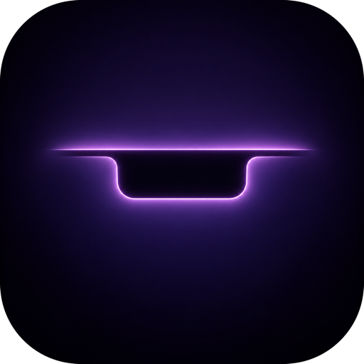

<h1 align="center">
  <br>
  
  <br>
  Dynamic Notch
  <br>
</h1>

<p align="center">
  <strong>Bespoke Live Activities for your MacBook Notch — Crafted with Apple-native elegance and simplicity.</strong>
</p>

<p align="center">
  <a href="README_zh.md">简体中文</a> | <a href="README.md">English</a>
</p>

<p align="center">
  <a href="https://github.com/linchi07/dynamic_notch/releases/latest"></a>
  
  
  
  
</p>

---

## 📖 Origin & Upstream Acknowledgments

**Dynamic Notch** is a dedicated fork of **[TheBoredTeam/boring.notch](https://github.com/TheBoredTeam/boring.notch)**.

Our sincere thanks to the original developers and every contributor at TheBoredTeam. Their open-source work made this fork possible; Dynamic Notch builds on their foundation rather than claiming to replace it.

---

## 💡 Philosophy & Key Evolutions

Compared with the upstream project, this fork aims for a simpler, more restrained interface that follows Apple's native Live Activity design philosophy more closely: glanceable information, clear hierarchy, and motion that serves the content. It retains and extends useful utilities without making the notch feel crowded.

We adhere to the philosophy that "less is more." The notch is at its best when it seamlessly blends into the hardware during idle moments, emerging fluidly only when real-time information demands attention.

### Changes from upstream (`origin/main`)

- **Project and scope:** Renamed the app, Xcode project, target, and scheme to DynamicNotch; removed calendar and reminders integration. The file shelf remains available.
- **Notch and HUD:** Reworked compact/open presentation, media wings, track-change sneak peeks, battery notifications, and a separate floating volume/brightness HUD with animated transitions.
- **Media:** Added a six-bar music visualizer, multiple player support, per-app playback source filtering, and synchronized activity state.
- **Shelf and scratchpad:** Refined file drop, preview, and sharing flows; added a persistent text scratchpad with an editor window and dedicated drop landing view.
- **Window Snap Layouts:** Added a Windows 11-style top-edge window snapping system with 5 selectable grid layouts, Shift-key smart arrangement for all active windows, and an optional experimental frosted-glass ghost animation (SkyLight compositing) to eliminate native visual flicker; requires Accessibility permission.
- **External live activities:** Added a local Unix-domain socket for authorized macOS apps to publish activities and alerts. Connections require an app bundle identifier and user approval; see [API documentation](docs/uds-live-activities.md).
- **Settings and localization:** Reorganized settings, gated developer options, and expanded translated UI strings. The later architecture also moved helper functionality into the app process.
- **OS appearance:** UI adaptation for macOS 26 Tahoe is in progress; adaptation for macOS 27 (Golden Gate) is planned. This is a roadmap, not a compatibility guarantee.

---

## 📥 Download & Installation

### Requirements:
- **OS**: macOS 14.0 or newer; UI adaptation for macOS 26 Tahoe is in progress, with macOS 27 (Golden Gate) planned
- **Hardware**: Apple Silicon MacBook with a built-in notch; Intel Macs and external-display-only setups are not supported

---

### Manual Install:

1. Download the latest `DynamicNotch.dmg` from the **[Releases Page](https://github.com/linchi07/dynamic_notch/releases/latest)**;
2. Open the DMG and drag **Dynamic Notch.app** to your **Applications** folder;
3. If the downloaded build has not been signed with Developer ID and notarized, macOS Gatekeeper may show a security warning. Future Developer ID-signed, notarized releases are intended to avoid this warning; signing alone is not the same as notarization.
4. Follow the prompt to grant Accessibility permissions in **System Settings → Privacy & Security → Accessibility**.

---

## 🛠️ Building from Source

To inspect the source code or build the project yourself:

### Requirements:
- macOS 14.0+
- An Xcode version compatible with the project's Swift packages and macOS 14 SDK

### Steps:
```bash
# 1. Clone repository
git clone https://github.com/linchi07/dynamic_notch.git
cd dynamic_notch

# 2. Open project in Xcode
open DynamicNotch.xcodeproj

# 3. Select DynamicNotch scheme and press Cmd + R to build & run
```

---

## 🗺️ Architectural Comparison

| Dimension | Upstream (Boring Notch) | Fork (Dynamic Notch) |
| :--- | :--- | :--- |
| **Calendar / Reminders** | Integrated | Removed |
| **Shelf** | File shelf | Retained and refined; text scratchpad added |
| **Media** | Music controls and visualizer | Six-bar visualizer, source filtering, and refreshed media UI |
| **HUD and alerts** | Built-in system-event UI | Floating HUD, battery popup, and track sneak peek |
| **Window Snap Layouts** | No top-edge snap workflow | Windows 11-style snap chooser (5 presets, Shift all-windows tiling, frosted ghost animator) |
| **Developer API** | No local live-activity socket | Authorized Unix-domain socket API |
| **Design direction** | Broad utility feature set | Simpler, more native Live Activity-inspired presentation |

---

## 📄 License & Attributions

This project is distributed under the **GPL-3.0** license, inheriting the licensing terms of the upstream project. See [LICENSE](LICENSE) for the full, unmodified license text, and [NOTICE](NOTICE) for the copyright holders.

> Dynamic Notch is a derivative work of Boring Notch, so it stays under GPL-3.0 and cannot be relicensed under different terms.

**Copyright**

- Copyright (C) 2026 linchi — Dynamic Notch
- Copyright (C) The Bored Team and the Boring Notch contributors — upstream Boring Notch

### Acknowledgments:
- **[TheBoredTeam/boring.notch](https://github.com/TheBoredTeam/boring.notch)**: The upstream project this repository originated from;
- **[MediaRemoteAdapter](https://github.com/ungive/mediaremote-adapter)**: macOS Now Playing native listener;
- **[Pow](https://github.com/movingparts-io/Pow)**: Delightful SwiftUI animation springs;
- **[Defaults](https://github.com/sindresorhus/Defaults)**: Clean user defaults persistence.

---

<p align="center">
  <em>Crafted with care by linchi07 &middot; Dedicated to the Apple design ethos.</em>
</p>
